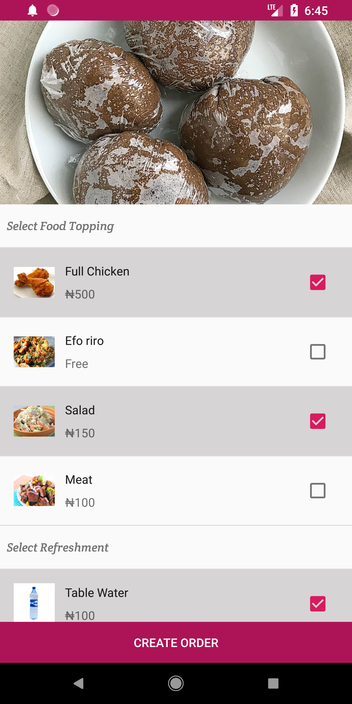

CamFood Android application
===================================

This is android application which aim to reduce queue at restaurants and provide better experience
to restaurant customers.
The app itself provide customers means to create orders and have it delivered to there location or 
eat it at the restaurant, it also provide restaurant owners interface to create order, process order 
and cash out.

Introduction
------------

Steps for trying out this sample:
* Compile and install the mobile app onto your mobile device or emulator.

* Start the mobile app and create account as either a customer or a restaurant

The backend was handle with [Firebase Database][18] and [Firebase Storage][19]

Some of the UI widgets and design patterns used in the mobile app include:
* Use of Material theme including definition of primary and accent colors
* [AppCompat][9] usage for Material theme backward compatibility
* Metrics and keylines based on the [Material guidelines][10]
* Window content and activity transitions based on the
[Material guidelines][11]
* Use of the [RecyclerView][12] widget
* CoordinatorLayout[23] and FloatingActionButton[24] from the Design Support library[25]
* Material animations such as activity and shared element transitions

[1]: http://developer.android.com/wear/
[2]: https://developer.android.com/google/play-services/
[3]: https://developer.android.com/reference/android/support/v4/app/NotificationCompat.WearableExtender.html
[4]: https://developer.android.com/reference/com/google/android/gms/wearable/DataApi.html
[5]: https://developer.android.com/reference/com/google/android/gms/wearable/MessageApi.html
[6]: https://developer.android.com/google/play-services/location.html
[7]: https://developer.android.com/reference/com/google/android/gms/location/FusedLocationProviderApi.html
[8]: https://developer.android.com/reference/com/google/android/gms/location/Geofence.html
[9]: https://developer.android.com/tools/support-library/features.html#v7-appcompat
[10]: http://www.google.com/design/spec/layout/metrics-keylines.html
[11]: http://www.google.com/design/spec/animation/meaningful-transitions.html
[12]: https://developer.android.com/reference/android/support/v7/widget/RecyclerView.html
[13]: http://developer.android.com/reference/android/support/wearable/view/GridViewPager.html
[14]: http://developer.android.com/reference/android/support/wearable/view/DotsPageIndicator.html
[15]: http://developer.android.com/reference/android/support/wearable/view/WatchViewStub.html
[16]: http://developer.android.com/reference/android/view/View.OnApplyWindowInsetsListener.html
[17]: https://developer.android.com/training/wearables/apps/layouts.html#UiLibrary
[18]: https://firebase.google.com/products/realtime-database/
[19]: https://firebase.google.com/products/storage/
[23]: https://developer.android.com/reference/android/support/design/widget/CoordinatorLayout.html
[24]: https://developer.android.com/reference/android/support/design/widget/FloatingActionButton.html
[25]: http://android-developers.blogspot.com/2015/05/android-design-support-library.html
[26]: http://developer.android.com/reference/android/support/wearable/view/ActionPage.html

Pre-requisites
--------------

- Android SDK 28
- Android Build Tools v28.0.3
- Android Support Repository

Screenshots
-------------
Sign up
 

Create Order
 

Getting Started
---------------

This sample uses the Gradle build system. To build this project, use the
"gradlew build" command or use "Import Project" in Android Studio.

Support
-------

- Google+ Community: https://plus.google.com/communities/105153134372062985968
- Stack Overflow: http://stackoverflow.com/questions/tagged/android

If you've found an error in this sample, please file an issue:
https://github.com/afomic/camfood

Patches are encouraged, and may be submitted by forking this project and
submitting a pull request through GitHub. Please see CONTRIBUTING.md for more details.

License
-------

Licensed to the Apache Software Foundation (ASF) under one or more contributor
license agreements.  See the NOTICE file distributed with this work for
additional information regarding copyright ownership.  The ASF licenses this
file to you under the Apache License, Version 2.0 (the "License"); you may not
use this file except in compliance with the License.  You may obtain a copy of
the License at

http://www.apache.org/licenses/LICENSE-2.0

Unless required by applicable law or agreed to in writing, software
distributed under the License is distributed on an "AS IS" BASIS, WITHOUT
WARRANTIES OR CONDITIONS OF ANY KIND, either express or implied.  See the
License for the specific language governing permissions and limitations under
the License.
